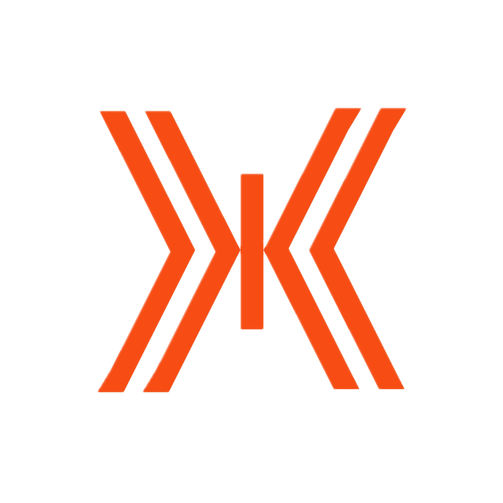

<!-- Logo -->

<p align="center">
  
</p>

<h1 align="center">🟠 PalX</h1>

<p align="center">
  <strong>Build. Market. Grow.</strong>
</p>

<p align="center">
  A modern web development and digital marketing agency helping businesses create powerful online experiences.
</p>

<p align="center">
  💻 Web Development • 🎨 UI/UX Design • 📈 Digital Marketing • 🚀 Growth Solutions
</p>

<p align="center">
  📍 Udaipur, Rajasthan, India
</p>

---

## 🧡 About PalX

**PalX** is a web development and digital marketing agency based in **Udaipur, Rajasthan**, dedicated to helping businesses establish a strong digital presence.

We specialize in building modern websites, crafting engaging user experiences, and implementing growth-focused marketing strategies that help brands stand out online.

Our goal is simple:

> Create digital experiences that look great, perform fast, and generate results.

---

## ✨ Key Features

### 🌐 Modern Business Website

* Fully responsive design
* Mobile-first experience
* Professional agency branding
* Optimized user experience

### ⚡ Performance Focused

* Fast loading speeds
* Optimized assets
* Modern development practices
* SEO-friendly architecture

### 📈 Marketing Ready

* Conversion-focused layouts
* Lead generation optimization
* Search engine optimization support
* Growth-oriented design strategy

### 📲 WhatsApp Lead Integration

* Contact form submissions sent directly to WhatsApp
* Instant inquiry delivery
* Environment-based configuration
* Seamless communication workflow

---

## 🚀 Services

### 💻 Web Development

We build modern, scalable, and high-performing websites tailored to business needs.

#### Solutions

* Business Websites
* Portfolio Websites
* Landing Pages
* E-Commerce Websites
* Custom Web Applications
* Website Redesigns
* Website Maintenance
* Performance Optimization

---

### 🎨 UI / UX Design

Beautiful and intuitive experiences designed around users.

#### Services

* User Interface Design
* User Experience Design
* Wireframing
* Prototyping
* Responsive Design
* Design Systems
* Brand Consistency

---

### 📈 Digital Marketing

Helping businesses reach more customers and generate measurable growth.

#### Services

* Search Engine Optimization (SEO)
* Social Media Marketing
* Paid Advertising
* Content Strategy
* Local Business Marketing
* Lead Generation Campaigns
* Analytics & Reporting

---

### 🚀 Growth Solutions

Strategic digital solutions designed to help businesses scale.

#### Services

* Digital Strategy
* Brand Positioning
* Website Audits
* Marketing Consultation
* Conversion Optimization
* Online Presence Enhancement

---

## 📲 WhatsApp Contact Integration

The website includes a built-in contact system that automatically routes inquiries to WhatsApp.

### How It Works

1. Visitor fills out the contact form.
2. Form data is validated.
3. A formatted message is generated.
4. The inquiry is delivered directly to the configured WhatsApp number.

### Example Message

```text
New Contact Inquiry

Name: John Doe
Email: john@example.com
Phone: +91 9876543210

Message:
I would like a quotation for a business website.
```

### Environment Configuration

```env
VITE_WHATSAPP_NUMBER=your_whatsapp_number
```

This setup enables businesses to receive leads instantly without relying on external CRM platforms.

---

## 🛠️ Technology Stack

### Frontend

* React
* Vite
* JavaScript (ES6+)
* HTML5
* CSS3

### Design

* Responsive Design
* Modern UI Components
* Mobile-First Development

### Integrations

* WhatsApp API Integration
* Contact Form Handling

### Deployment

* Vercel
* Netlify
* Cloud Hosting Platforms

---

## 🧠 Project Highlights

### Responsive Design

The entire website is optimized for:

* 📱 Mobile Devices
* 💻 Laptops
* 🖥️ Desktops
* 📟 Tablets

### SEO Ready

Built with search engine visibility in mind:

* Semantic HTML
* Optimized Structure
* Fast Performance
* Accessibility Best Practices

### Lead Generation Focused

Every section is designed to encourage:

* Contact Requests
* Service Inquiries
* Business Consultations
* Customer Engagement

---

## 📂 Project Structure

```bash
src/
├── assets/
├── components/
├── pages/
├── styles/
├── utils/
├── App.jsx
└── main.jsx

public/
└── logo.png
```

---

## ⚙️ Getting Started

### Clone the Repository

```bash
git clone <repository-url>
cd palx
```

### Install Dependencies

```bash
npm install
```

### Configure Environment Variables

Create a `.env` file:

```env
VITE_WHATSAPP_NUMBER=your_whatsapp_number
```

### Start Development Server

```bash
npm run dev
```

### Build for Production

```bash
npm run build
```

---

## 🌍 Mission

Our mission is to help businesses leverage technology and digital marketing to achieve sustainable growth and stronger customer connections.

We believe great digital products should be:

* Fast ⚡
* Beautiful 🎨
* Accessible ♿
* Effective 📈

---

## 🤝 Contributing

Contributions, suggestions, and improvements are welcome.

1. Fork the repository
2. Create a feature branch
3. Commit your changes
4. Push to your branch
5. Open a Pull Request

---

## 📍 Location

**PalX**
Udaipur, Rajasthan, India 🇮🇳

---

## 📬 Contact

Interested in working together?

### Reach Out

📧 Email: [hello@palx.in](mailto:hello@palx.in)
🌐 Website: https://palx.in
📍 Udaipur, Rajasthan, India

---

<p align="center">
  
</p>

<h3 align="center">🧡 PalX</h3>

<p align="center">
  Building modern websites, creating meaningful digital experiences, and helping businesses grow online.
</p>
